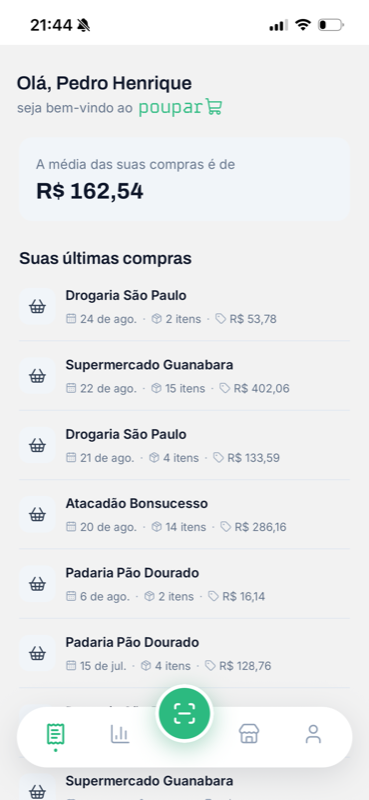
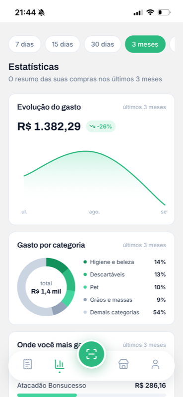
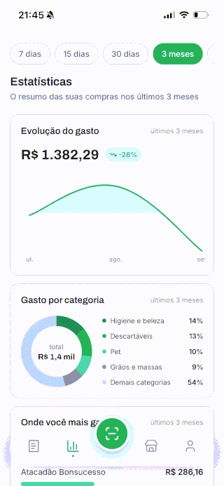

> 🌎 **English** · [Português (Brasil)](README.md)

# poupar-app

Mobile app for **Poupar** — a grocery spending tracker that turns a photo of a receipt into a
structured purchase, with per-product price history and spending broken down by category.

React Native + Expo in strict TypeScript, with NativeWind, React Query and a hard separation between
UI, data and utilities. It consumes [`poupar-api`](../poupar-api), which lives in the sibling
repository.

---

## Preview

<p align="center">
  
  
  
</p>

<p align="center">
  
  <br />
  <em>From receipt to structured purchase: merchant, photo, extraction and review.</em>
</p>

---

## Table of contents

- [Preview](#preview)
- [Features](#features)
- [Stack](#stack)
- [Architecture](#architecture)
- [Receipt scan flow](#receipt-scan-flow)
- [Authentication and session](#authentication-and-session)
- [Navigation](#navigation)
- [Design system](#design-system)
- [Project layout](#project-layout)
- [Requirements](#requirements)
- [Local setup](#local-setup)
- [Environment variables](#environment-variables)
- [Scripts](#scripts)
- [Verification](#verification)
- [Code conventions](#code-conventions)
- [AI tooling](#ai-tooling)
- [License](#license)

---

## Features

| Screen | What it does |
| --- | --- |
| **Login** | Sign in and sign up in bottom sheets, plus password recovery through a code sent by e-mail. Sign up already returns tokens, so a new account lands signed in. |
| **Receipts** | Lists recent purchases with merchant, date, item count and total, plus a summary card with the average spend. |
| **Statistics** | Period filter (7 days to 1 year), spend over time, split by product category, merchant ranking and price history for a chosen product. |
| **Scan** | A four-step flow: pick the merchant → shoot the receipt (camera or gallery) → wait for extraction → review the draft and confirm. |
| **Manual purchase** | Form with a dynamic item list (description, quantity, unit and price) to record a purchase with no receipt. |
| **Merchants** | Searchable list, shortcut to the most recent ones and full CRUD — create, rename, recategorize and delete. |
| **Purchase detail** | Receipt items with quantity, unit, unit price, discount and total. |
| **Profile** | Account data, name editing and sign out. |

---

## Stack

| Layer | Technology |
| --- | --- |
| Runtime | Expo 57 (dev client) + React Native 0.86 + React 19 |
| Language | TypeScript 6 in `strict` mode + `noUncheckedIndexedAccess` |
| Styling | NativeWind 4 (Tailwind 3) + `class-variance-authority` + `tailwind-merge` |
| Remote data | TanStack Query 5 |
| HTTP | axios, with a refresh-token interceptor |
| Forms | react-hook-form + Zod 4 through `@hookform/resolvers` |
| Navigation | React Navigation 7 (native stack + bottom tabs) |
| UI | `@gorhom/bottom-sheet`, `lucide-react-native`, `react-native-gifted-charts`, `react-native-reanimated` |
| Native | `expo-camera`, `expo-image-picker`, `expo-secure-store`, `expo-font` |
| Lint/Format | Biome 2 (+ husky and lint-staged on pre-commit) |
| Package manager | yarn 1.22 |

---

## Architecture

Three layers, with dependencies always pointing to the right:

```
presentation ──▶ data ──▶ shared
```

| Layer | Responsibility |
| --- | --- |
| `src/presentation` | Screens, components and layouts. UI and UI orchestration only. |
| `src/data` | Config (axios, query client, errors), contexts, libs and domain modules. The **only** part of the app that knows an API exists. |
| `src/shared` | Navigation, pure utilities, constants, hooks and assets. Knows neither UI nor data. |

Rules the project treats as non-negotiable:

- `data/` never imports from `presentation/`; `shared/` never imports from either of the other two.
- A screen never imports from another screen. What two of them need moves up to
  `presentation/components/` (UI) or `shared/utils/` (pure function).
- `axios`, `useQuery` and `useMutation` exist only inside `src/data/`.

### Component and controller

The `.tsx` holds JSX; everything that is not markup lives in a `use<Name>Controller.ts` next to it —
state, effects, navigation, forms, derivations, use case calls.

```
Merchants/
├── Merchants.tsx                 JSX, named export
├── useMerchantsController.ts     state, filters, handlers
├── interfaces.ts                 screen-domain types
├── utils.ts                      pure helpers
└── components/                   pieces only this screen uses
```

The controller returns a flat object, never nested, and the component destructures it in a single
call. A component used by two or more screens moves up to `presentation/components/`.

### Anatomy of a data module

One module per domain (`auth`, `merchant`, `purchase`, `scan`, `product`, `categorySpend`):

```
src/data/modules/purchase/
├── types/PurchaseTypes.ts               API mirror, in cents and thousandths
├── types/Purchase.ts                    domain type, already in currency and units
├── services/PurchaseService.ts          one function per endpoint
├── services/mappers/*Mapper.ts          toDomain / toPersistence
├── keys/PurchaseKeys.ts                 query key and mutation key enums
├── constants/purchaseErrorMessages.ts   ErrorCode → pt-BR message
└── useCases/<action>/
    ├── use<Action>.ts                   React Query wrapper
    ├── interfaces.ts                    options the caller controls
    └── schemas/<action>Schema.ts        form Zod schema + inferred type
```

The use case **renames** what React Query returns into domain vocabulary — that is what keeps the UI
from looking like React Query:

```ts
export function useSignIn() {
  const { mutateAsync, isPending } = useMutation({
    mutationKey: [AuthMutationKeys.SIGN_IN],
    mutationFn: async (payload: ISignInPayload) => await AuthService.signIn(payload)
  });

  return { signIn: mutateAsync, isSigningIn: isPending };
}
```

### Format boundary

The API carries money as integer cents and fractional quantities as integer thousandths. That
translation lives **only** in the service mappers, backed by the helpers in `@shared/utils` (`Money`,
`Quantity`, `Decimal`) — never in a component, a controller or a query `select`.

```ts
function toDomain(response: IListPurchasesResponse): IPurchase[] {
  return response.map((purchase) => ({
    itemsCount: purchase.itemCount,
    totalAmount: Money.fromCents(purchase.totalCents)
  }));
}
```

---

## Receipt scan flow

Extraction runs on a queue in the backend, so the app follows it by polling and takes ownership of
the draft before it becomes a purchase:

```
┌───────────────────┐
│ 1. Merchant       │  useListMerchants — pick one or create it on the spot
└─────────┬─────────┘
          ▼
┌───────────────────┐
│ 2. Photo          │  expo-camera or expo-image-picker (HEIC → JPEG on iOS)
└─────────┬─────────┘
          ▼
┌───────────────────┐   POST /scans          ┌──────────────────────────┐
│ useSendScanPhoto  │ ─────────────────────▶ │ scanId + presigned POST  │
│                   │ ◀───────────────────── │                          │
└─────────┬─────────┘                        └──────────────────────────┘
          │ multipart upload straight to S3 (separate axios instance, no Authorization)
          ▼
┌───────────────────┐   GET /scans/{scanId}  ┌──────────────────────────┐
│ 3. useGetScan     │ ◀────── polling ─────▶ │ PENDING → PROCESSING →   │
│    2s, 180s cap   │                        │ AWAITING_REVIEW / FAILED │
└─────────┬─────────┘                        └──────────────────────────┘
          ▼
┌───────────────────┐   POST /scans/{scanId}/confirm
│ 4. Review         │ ─────────────────────▶ purchase created, cache invalidated
└───────────────────┘
```

Design decisions worth calling out:

- **Polling that survives a network blip.** `refetchInterval` looks at `state.status` on top of the
  scan `status`: without it, one isolated error mid-polling would throw the screen back to the
  spinner once the network recovered.
- **The 180s cap.** That is the timeout of a single `processScan` lambda attempt. Waiting for the
  worst case (3 attempts) would hold the user nine minutes on a spinning screen — the screen gives
  up and offers a retry, while the scan stays alive in the backend.
- **Upload on its own client.** The S3 presigned POST rejects the `Authorization` header, so the
  upload uses an axios instance with no interceptor. The `fields` go before the `file` field, which
  S3 requires last.
- **HEIC transcoded.** The iOS gallery hands back HEIC, a format the API does not sign; the picker
  runs in `compatible` mode so the upload is not rejected after the user already chose the image.

---

## Authentication and session

- Tokens live in `expo-secure-store` (`AuthTokensManager`), under the key `poupar.auth-tokens`.
- `AuthProvider` loads the tokens at boot, injects the access token into axios and only then renders
  the tree — which is why the app never flashes the login screen at an already-signed-in user.
- The `poupar-api` Cognito pool uses **refresh token rotation with a 0s grace period**: the old
  token dies the instant a refresh happens. That is why the interceptor shares a single promise
  across all concurrent 401s — two parallel refreshes would kill the session.
- The API's `Forbbiden` responds with **401**, not 403. The interceptor checks the error `code`
  before burning a rotation on what is really a permission error.
- A failed refresh triggers `signOut`: tokens erased, React Query cache cleared, back to `AuthStack`.

---

## Navigation

```
Navigation.tsx           NavigationContainer
└── RootStack            branches on the session
    ├── AuthStack        Login · ForgotPassword · ResetPassword
    └── AppStack
        ├── AppTabs      Receipts · Statistics · [Scan] · Merchants · Profile
        ├── PurchaseDetail
        ├── ManualPurchase   fullScreenModal
        └── Scan             fullScreenModal
```

- `headerShown: false` is the default: the header is a component of the screen, not of the navigator.
- The middle tab in `CustomTabBar` is a raised button. The `Scan` route exists in the tab bar only to
  reserve that slot — the press is intercepted and opens the modal on the parent stack.
- A screen presented as `fullScreenModal` gets its own `GestureHandlerRootView` +
  `BottomSheetModalProvider`: the native modal sits above the root view, and without the nested
  provider the bottom sheet would open behind it.
- `PurchaseDetail` receives the whole purchase as a param because the API has no
  `GET /purchases/{id}` — only the listing returns those fields; the screen fetches just the items.

---

## Design system

A closed vocabulary of color, font and size. New UI composes what exists; it does not invent tokens.

- **Text** goes through `AppText` only — `variant` (`text` Inter · `title` Archivo), `size` (`xs` 12
  … `6xl` 56), `weight`, `color`, `align`. A size outside the scale is a conversation, not a loose
  `text-[15px]`.
- **Color** comes from `tailwind.config.js`, mirrored in `@shared/constants/colors`: `brand.light`
  `#42D59E`, `brand.main` `#2CBA80`, `brand.dark` `#13915D`, `danger` `#E5484D` and the
  `grays.50…900` ramp. In JSX, `className`; in props that demand a value (icons,
  `placeholderTextColor`), `COLORS`. The two files never diverge.
- **Variants** use `cva`, applied through `cn()` from `@shared/utils/cn` — that is what resolves
  class conflicts and lets the consumer's `className` win.
- **Charts** consume the categorical palette in `@shared/constants/chart` in declaration order: the
  first entry always lands on the largest slice.
- **Every screen resolves three states**: loading (its own skeleton), empty (`<Name>ListEmpty`, which
  tells "nothing here" apart from "the search found nothing") and error (`ErrorState`, with a retry
  path).
- **Accessibility**: `accessibilityRole` on every pressable, `accessibilityLabel` whenever the
  visible content does not describe the action, `hitSlop` under ~44px and touch feedback on both
  platforms.

---

## Project layout

```
src/
├── presentation/
│   ├── components/       reusable primitives (AppText, Button, Input, Skeleton, ...)
│   ├── layouts/          ScreenLayout
│   └── screens/          one folder per screen, with their own components/
├── data/
│   ├── config/           api.ts, apiError.ts, env.ts, queryClient.ts
│   ├── contexts/         AuthProvider
│   ├── libs/             AuthTokensManager
│   └── modules/          auth, merchant, purchase, scan, product, categorySpend
├── shared/
│   ├── navigation/       Navigation, RootStack, AuthStack, AppStack, AppTabNavigator
│   ├── constants/        colors, chart, storageKeys
│   ├── hooks/            useForceRender
│   ├── utils/            money, quantity, decimal, currency, date, cnpj, text, percent, cn
│   └── assets/
└── styles/global.css     Tailwind directives

.claude/                  project rules, skills and subagents
```

---

## Requirements

- Node.js 20+
- yarn 1.22 (`corepack enable`)
- Xcode 16+ (iOS) and/or Android Studio with an SDK and emulator configured
- A deployed `poupar-api` — the app ships no backend mock

> The `ios/` and `android/` folders are generated (`expo prebuild`) and not committed. The app uses
> `expo-dev-client`: Expo Go will **not** run this project.

---

## Local setup

```bash
git clone <repo-url> poupar-app
cd poupar-app
yarn install
cp .env.example .env   # fill in EXPO_PUBLIC_API_URL
```

Run it on a simulator or device — the first command prebuilds and compiles the dev client:

```bash
yarn ios       # expo run:ios
yarn android   # expo run:android
```

With the dev client already installed, the day-to-day loop is just the bundler:

```bash
yarn start
```

Validate before calling anything done:

```bash
yarn typecheck && yarn lint && node .claude/scripts/check-classes.mjs
```

---

## Environment variables

| Variable | Required | Description |
| --- | --- | --- |
| `EXPO_PUBLIC_API_URL` | yes | Base URL of `poupar-api`. E.g. `https://xxxxxxxxxx.execute-api.sa-east-1.amazonaws.com` |

Metro inlines `process.env.EXPO_PUBLIC_*` at build time, so the variable is read through a **static
reference** in [`src/data/config/env.ts`](src/data/config/env.ts) — destructuring `process.env` would
yield `undefined`. That file throws at boot if the URL is missing, and any new variable also goes
into `.env.example`.

> Changed `.env`? Restart the bundler with `yarn start --clear`. An inlined value does not reload on
> its own.

---

## Scripts

| Command | What it does |
| --- | --- |
| `yarn start` | Starts the Metro bundler. |
| `yarn ios` / `yarn android` | `expo run:*` — prebuild + native build + dev client install. |
| `yarn typecheck` | `tsc --noEmit` across the project. |
| `yarn lint` | `biome check .` — lint, formatting and import order. |
| `yarn lint:fix` | Applies Biome's automatic fixes. |
| `yarn format` | Formatting only. |

Pre-commit runs `lint-staged` through husky: Biome with `--write` over the staged files.

---

## Verification

There is no test framework in this project. No task is done without all three commands:

```bash
yarn typecheck
yarn lint
node .claude/scripts/check-classes.mjs
```

The third one exists because **NativeWind does not complain about a class that does not exist**:
`bg-brand-mainn` passes typecheck and Biome, and simply paints nothing. The script scans `className`,
`cva` and `cn`, generates the Tailwind CSS for the classes it found and flags the ones that produced
no rule.

> Known limitation: arbitrary values in brackets are not validated per unit — `p-[oops]` passes.
> Check brackets by eye.

---

## Code conventions

- Named exports always. `export default` only in `App.tsx`.
- `interface` prefixed with `I` (`IButtonProps`, `IMerchant`); `type` with no prefix for unions and
  inferred types, suffixed with `Type` (`AccountRoleType`, `SignInFormType`).
- `enum` only for cache keys and error codes, with the value equal to the key name.
- Component props always in a sibling `interfaces.ts`, never inline in the signature.
- `function` declarations for components, hooks and handlers. A UI handler is `handle<Event>`; the
  prop that receives it is `on<Event>`.
- Path aliases `@/*`, `@data/*`, `@presentation/*`, `@shared/*` when crossing a top-level folder
  boundary; relative imports inside a screen or a data module.
- `import type` is mandatory for type-only imports. Imports are organized by Biome, not by hand.
- Every Zod schema lives in `src/data/modules/<module>/useCases/<action>/schemas/`, even when a
  single form uses it.
- Mutation errors are handled in the controller, with `try/catch` and
  `get<Module>ErrorMessage(error, fallback)`; query errors are returned for the screen to decide.
  Cache invalidation lives in the use case's `onSuccess`, never scattered across controllers.
- Comments in pt-BR, `/** */`, and only to explain **why**. Nothing that repeats the code.
- No `console.log`, no `any`, no `as` to silence the compiler (`as const` is fine), no
  `StyleSheet.create`, no abstraction built for a hypothetical requirement.
- Biome formatting: 2 spaces, single quotes (JSX included), mandatory semicolons, no trailing
  commas, 90-column width.

The full per-file-type rules live in [`.claude/rules/`](.claude/rules/):
[core](.claude/rules/core.md) ·
[components](.claude/rules/components.md) ·
[design-system](.claude/rules/design-system.md) ·
[controllers](.claude/rules/controllers.md) ·
[data-layer](.claude/rules/data-layer.md) ·
[navigation](.claude/rules/navigation.md)

---

## AI tooling

The repository carries its own Claude Code tooling under [`.claude/`](.claude/):

| Command | What it does |
| --- | --- |
| `/feature` | End to end: recon → approved plan → UI → data → logic → verification → review. |
| `/feature-ui` | UI only, from a screenshot, a Figma link (MCP) or a description. |
| `/feature-data` | The data layer of a single endpoint. |
| `/feature-logic` | Logic only: swap mocks for use cases, states, forms. |
| `/feature-review` | An impartial review of what was already built. |

Three subagents back those flows: `feature-scout` (inventory of what already exists and can be
reused), `api-contract-scout` (extracts the exact contract of a `poupar-api` endpoint) and
`feature-reviewer` (reviews against the rules; reports, never fixes).

[`.mcp.json`](.mcp.json) points at Figma's local Dev Mode MCP (`http://127.0.0.1:3845/mcp`), which
requires Figma Desktop open with the server enabled in Preferences. Without it, the UI flow falls
back to a screenshot or a description.

---

## License

Private project (`"private": true`). No distribution license defined.
