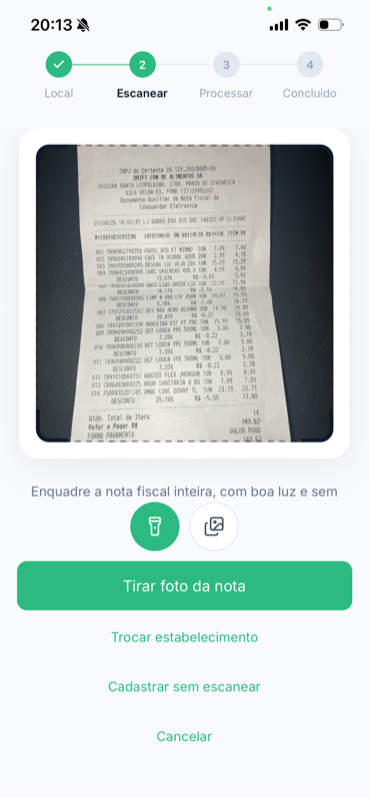
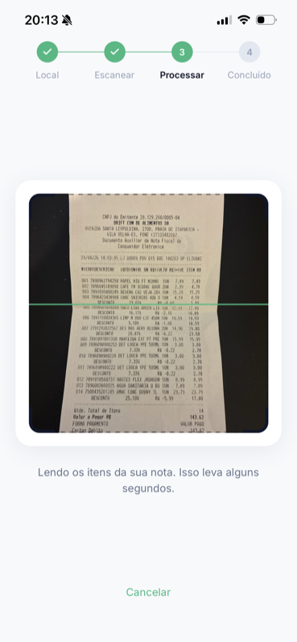

> 🌎 [English](README.en.md) · **Português (Brasil)**

# poupar-app

App mobile do **Poupar** — controle de gastos de supermercado que transforma a foto de um cupom
fiscal em compra estruturada, com histórico de preço por produto e gasto por categoria.

React Native + Expo em TypeScript estrito, com NativeWind, React Query e uma separação rígida entre
interface, dados e utilitários. Consome a [`poupar-api`](../poupar-api), que fica no repositório
irmão.

---

## Preview

<p align="center">
  
  
  
</p>

<p align="center">
  
  
  <br />
  <em>Do cupom fiscal à compra estruturada: estabelecimento, foto, extração e revisão.</em>
</p>

---

## Sumário

- [Preview](#preview)
- [Principais funcionalidades](#principais-funcionalidades)
- [Stack](#stack)
- [Arquitetura](#arquitetura)
- [Fluxo de scan de cupom](#fluxo-de-scan-de-cupom)
- [Autenticação e sessão](#autenticação-e-sessão)
- [Navegação](#navegação)
- [Design system](#design-system)
- [Estrutura de pastas](#estrutura-de-pastas)
- [Pré-requisitos](#pré-requisitos)
- [Configuração local](#configuração-local)
- [Variáveis de ambiente](#variáveis-de-ambiente)
- [Scripts](#scripts)
- [Verificação](#verificação)
- [Convenções de código](#convenções-de-código)
- [Tooling de IA](#tooling-de-ia)
- [Licença](#licença)

---

## Principais funcionalidades

| Tela | O que faz |
| --- | --- |
| **Login** | Entrada e cadastro em bottom sheets, recuperação de senha por código enviado no e-mail. O cadastro já devolve tokens e entra logado. |
| **Recibos** | Lista as últimas compras com estabelecimento, data, itens e total, mais um card de resumo com o gasto médio. |
| **Estatísticas** | Filtro de período (7 dias a 1 ano), evolução do gasto no tempo, divisão por categoria de produto, ranking de estabelecimentos e histórico de preço de um produto escolhido. |
| **Scan** | Fluxo em quatro passos: escolher o estabelecimento → fotografar o cupom (câmera ou galeria) → aguardar a extração → revisar o rascunho e confirmar. |
| **Compra manual** | Formulário com lista dinâmica de itens (descrição, quantidade, unidade e preço) para lançar uma compra sem cupom. |
| **Estabelecimentos** | Lista com busca, atalho para os mais recentes e CRUD completo — criar, renomear, recategorizar e excluir. |
| **Detalhe da compra** | Itens do cupom com quantidade, unidade, preço unitário, desconto e total. |
| **Perfil** | Dados da conta, edição do nome e saída da sessão. |

---

## Stack

| Camada | Tecnologia |
| --- | --- |
| Runtime | Expo 57 (dev client) + React Native 0.86 + React 19 |
| Linguagem | TypeScript 6 em modo `strict` + `noUncheckedIndexedAccess` |
| Estilo | NativeWind 4 (Tailwind 3) + `class-variance-authority` + `tailwind-merge` |
| Dados remotos | TanStack Query 5 |
| HTTP | axios, com interceptor de refresh token |
| Formulários | react-hook-form + Zod 4 via `@hookform/resolvers` |
| Navegação | React Navigation 7 (native stack + bottom tabs) |
| UI | `@gorhom/bottom-sheet`, `lucide-react-native`, `react-native-gifted-charts`, `react-native-reanimated` |
| Nativo | `expo-camera`, `expo-image-picker`, `expo-secure-store`, `expo-font` |
| Lint/Format | Biome 2 (+ husky e lint-staged no pre-commit) |
| Package manager | yarn 1.22 |

---

## Arquitetura

Três camadas, com a dependência sempre apontando para a direita:

```
presentation ──▶ data ──▶ shared
```

| Camada | Responsabilidade |
| --- | --- |
| `src/presentation` | Screens, componentes e layouts. Só UI e orquestração de UI. |
| `src/data` | Config (axios, query client, erros), contexts, libs e módulos de domínio. É a **única** parte do app que sabe que existe uma API. |
| `src/shared` | Navegação, utilitários puros, constantes, hooks e assets. Não conhece nem UI nem dados. |

Regras que o projeto trata como invioláveis:

- `data/` não importa nada de `presentation/`; `shared/` não importa de nenhuma das duas.
- Uma screen **não** importa de outra screen. O que duas precisam sobe para
  `presentation/components/` (UI) ou `shared/utils/` (função pura).
- `axios`, `useQuery` e `useMutation` só existem dentro de `src/data/`.

### Componente e controller

O `.tsx` fica com JSX; tudo que não é markup mora num `use<Nome>Controller.ts` ao lado — estado,
efeito, navegação, formulário, derivação, chamada de use case.

```
Merchants/
├── Merchants.tsx                 JSX, export nomeado
├── useMerchantsController.ts     estado, filtros, handlers
├── interfaces.ts                 tipos do domínio da tela
├── utils.ts                      helpers puros
└── components/                   peças que só esta tela usa
```

O controller devolve um objeto plano, sem aninhar, e o componente desestrutura tudo numa chamada só.
Componente usado por duas ou mais screens sobe para `presentation/components/`.

### Anatomia de um módulo de dados

Um módulo por domínio (`auth`, `merchant`, `purchase`, `scan`, `product`, `categorySpend`):

```
src/data/modules/purchase/
├── types/PurchaseTypes.ts               espelho da API, em centavos e milésimos
├── types/Purchase.ts                    tipo de domínio, já em reais e unidades
├── services/PurchaseService.ts          uma função por endpoint
├── services/mappers/*Mapper.ts          toDomain / toPersistence
├── keys/PurchaseKeys.ts                 enums de query key e mutation key
├── constants/purchaseErrorMessages.ts   ErrorCode → mensagem pt-BR
└── useCases/<ação>/
    ├── use<Ação>.ts                     wrapper do React Query
    ├── interfaces.ts                    opções que o chamador controla
    └── schemas/<ação>Schema.ts          Zod do formulário + tipo inferido
```

O use case **renomeia** o que o React Query devolve para o vocabulário do domínio — é o que faz a UI
não parecer React Query:

```ts
export function useSignIn() {
  const { mutateAsync, isPending } = useMutation({
    mutationKey: [AuthMutationKeys.SIGN_IN],
    mutationFn: async (payload: ISignInPayload) => await AuthService.signIn(payload)
  });

  return { signIn: mutateAsync, isSigningIn: isPending };
}
```

### Fronteira de formato

A API trafega dinheiro em centavos inteiros e quantidade fracionária em milésimos. A tradução mora
**só** nos mappers do service, apoiada nos utilitários de `@shared/utils` (`Money`, `Quantity`,
`Decimal`) — nunca no componente, no controller ou num `select` de query.

```ts
function toDomain(response: IListPurchasesResponse): IPurchase[] {
  return response.map((purchase) => ({
    itemsCount: purchase.itemCount,
    totalAmount: Money.fromCents(purchase.totalCents)
  }));
}
```

---

## Fluxo de scan de cupom

A extração roda numa fila no backend, então o app acompanha por polling e assume o controle do
rascunho antes de virar compra:

```
┌───────────────────┐
│ 1. Estabelecimento│  useListMerchants — seleciona ou cria na hora
└─────────┬─────────┘
          ▼
┌───────────────────┐
│ 2. Foto           │  expo-camera ou expo-image-picker (HEIC → JPEG no iOS)
└─────────┬─────────┘
          ▼
┌───────────────────┐   POST /scans          ┌──────────────────────────┐
│ useSendScanPhoto  │ ─────────────────────▶ │ scanId + presigned POST  │
│                   │ ◀───────────────────── │                          │
└─────────┬─────────┘                        └──────────────────────────┘
          │ upload multipart direto no S3 (instância axios separada, sem Authorization)
          ▼
┌───────────────────┐   GET /scans/{scanId}  ┌──────────────────────────┐
│ 3. useGetScan     │ ◀────── polling ─────▶ │ PENDING → PROCESSING →   │
│    2s, teto 180s  │                        │ AWAITING_REVIEW / FAILED │
└─────────┬─────────┘                        └──────────────────────────┘
          ▼
┌───────────────────┐   POST /scans/{scanId}/confirm
│ 4. Revisão        │ ─────────────────────▶ compra criada, cache invalidado
└───────────────────┘
```

Decisões que valem destaque:

- **Polling que sobrevive a falha de rede.** O `refetchInterval` olha `state.status` além do
  `status` do scan: sem isso, um erro isolado no meio do polling jogaria a tela de volta ao spinner
  quando a rede voltasse.
- **Teto de 180s.** É o timeout de uma tentativa da lambda `processScan`. Esperar o pior caso
  (3 tentativas) seria segurar o usuário nove minutos numa tela que só gira — a tela desiste e
  oferece tentar de novo, com o scan seguindo vivo no backend.
- **Upload em cliente próprio.** O presigned POST do S3 recusa o header `Authorization`, então o
  upload usa uma instância axios sem interceptor. Os `fields` vão antes do campo `file`, que o S3
  exige por último.
- **HEIC transcodificado.** A galeria do iOS entrega HEIC, formato que a API não assina; o picker
  roda em modo `compatible` para o upload não ser recusado depois da escolha.

---

## Autenticação e sessão

- Os tokens ficam no `expo-secure-store` (`AuthTokensManager`), sob a chave `poupar.auth-tokens`.
- O `AuthProvider` carrega os tokens no boot, injeta o access token no axios e só então libera a
  árvore — daí o app não pisca a tela de login para quem já estava logado.
- O Cognito da `poupar-api` usa **rotação de refresh token com grace period 0s**: o token antigo
  morre no instante do refresh. Por isso o interceptor compartilha uma única promise entre todos os
  401 concorrentes — dois refreshes em paralelo derrubariam a sessão.
- O `Forbbiden` da API responde **401**, não 403. O interceptor checa o `code` do erro antes de
  gastar uma rotação num erro que é de permissão.
- Falha no refresh → `signOut`: tokens apagados, cache do React Query limpo, volta ao `AuthStack`.

---

## Navegação

```
Navigation.tsx           NavigationContainer
└── RootStack            decide pela sessão
    ├── AuthStack        Login · ForgotPassword · ResetPassword
    └── AppStack
        ├── AppTabs      Recibos · Estatísticas · [Scan] · Estabelecimentos · Perfil
        ├── PurchaseDetail
        ├── ManualPurchase   fullScreenModal
        └── Scan             fullScreenModal
```

- `headerShown: false` é o padrão: o cabeçalho é um componente da tela, não do navigator.
- A aba central do `CustomTabBar` é um botão elevado. A rota `Scan` existe na tab bar só para
  reservar o slot — o toque é interceptado e abre o modal no stack pai.
- Tela apresentada como `fullScreenModal` recebe um `GestureHandlerRootView` +
  `BottomSheetModalProvider` próprios: o modal nativo fica acima da view raiz, e sem o provider
  aninhado o bottom sheet abriria atrás dele.
- `PurchaseDetail` recebe a compra inteira por param porque a API não tem `GET /purchases/{id}` —
  só a listagem devolve esses campos; a tela busca apenas os itens.

---

## Design system

Vocabulário fechado de cor, fonte e tamanho. Interface nova compõe o que existe; não inventa token.

- **Texto** só via `AppText` — `variant` (`text` Inter · `title` Archivo), `size` (`xs` 12 …
  `6xl` 56), `weight`, `color`, `align`. Tamanho fora da escala é conversa, não `text-[15px]` solto.
- **Cor** vem de `tailwind.config.js`, espelhado em `@shared/constants/colors`: `brand.light`
  `#42D59E`, `brand.main` `#2CBA80`, `brand.dark` `#13915D`, `danger` `#E5484D` e a rampa
  `grays.50…900`. Em JSX, `className`; em prop que exige valor (ícone, `placeholderTextColor`),
  `COLORS`. Os dois arquivos nunca divergem.
- **Variantes** com `cva`, aplicadas por `cn()` de `@shared/utils/cn` — é o que resolve conflito de
  classe e deixa o `className` do consumidor sobrescrever.
- **Gráficos** consomem a paleta categórica de `@shared/constants/chart`, na ordem em que ela é
  declarada: o primeiro item sempre cai na maior fatia.
- **Toda tela resolve três estados**: carregando (skeleton próprio), vazio (`<Nome>ListEmpty`, que
  distingue "não há nada" de "a busca não achou") e erro (`ErrorState`, com o caminho de tentar de
  novo).
- **Acessibilidade**: `accessibilityRole` em todo elemento clicável, `accessibilityLabel` quando o
  conteúdo visível não descreve a ação, `hitSlop` abaixo de ~44px e feedback de toque nas duas
  plataformas.

---

## Estrutura de pastas

```
src/
├── presentation/
│   ├── components/       primitivos reutilizáveis (AppText, Button, Input, Skeleton, ...)
│   ├── layouts/          ScreenLayout
│   └── screens/          uma pasta por tela, com components/ próprios
├── data/
│   ├── config/           api.ts, apiError.ts, env.ts, queryClient.ts
│   ├── contexts/         AuthProvider
│   ├── libs/             AuthTokensManager
│   └── modules/          auth, merchant, purchase, scan, product, categorySpend
├── shared/
│   ├── navigation/       Navigation, RootStack, AuthStack, AppStack, AppTabNavigator
│   ├── constants/        colors, chart, storageKeys
│   ├── hooks/            useForceRender
│   ├── utils/            money, quantity, decimal, currency, date, cnpj, text, percent, cn
│   └── assets/
└── styles/global.css     diretivas do Tailwind

.claude/                  rules, skills e subagents do projeto
```

---

## Pré-requisitos

- Node.js 20+
- yarn 1.22 (`corepack enable`)
- Xcode 16+ (iOS) e/ou Android Studio com um SDK e emulador configurados
- Uma `poupar-api` deployada — o app não tem mock de backend

> As pastas `ios/` e `android/` são geradas (`expo prebuild`) e não versionadas. O app usa
> `expo-dev-client`: o Expo Go **não** roda este projeto.

---

## Configuração local

```bash
git clone <repo-url> poupar-app
cd poupar-app
yarn install
cp .env.example .env   # preencha EXPO_PUBLIC_API_URL
```

Rode num simulador ou dispositivo — o primeiro comando faz o prebuild e compila o dev client:

```bash
yarn ios       # expo run:ios
yarn android   # expo run:android
```

Com o dev client já instalado, o ciclo do dia a dia é só o bundler:

```bash
yarn start
```

Valide antes de dar qualquer coisa por pronta:

```bash
yarn typecheck && yarn lint && node .claude/scripts/check-classes.mjs
```

---

## Variáveis de ambiente

| Variável | Obrigatória | Descrição |
| --- | --- | --- |
| `EXPO_PUBLIC_API_URL` | sim | URL base da `poupar-api`. Ex.: `https://xxxxxxxxxx.execute-api.sa-east-1.amazonaws.com` |

O Metro faz inline de `process.env.EXPO_PUBLIC_*` em build time, então a variável é lida por
**referência estática** em [`src/data/config/env.ts`](src/data/config/env.ts) — desestruturar
`process.env` devolveria `undefined`. O arquivo derruba o app no boot se a URL faltar, e variável
nova entra também no `.env.example`.

> Mudou o `.env`? Reinicie o bundler com `yarn start --clear`. Valor inlineado não recarrega sozinho.

---

## Scripts

| Comando | O que faz |
| --- | --- |
| `yarn start` | Sobe o Metro bundler. |
| `yarn ios` / `yarn android` | `expo run:*` — prebuild + build nativo + instalação do dev client. |
| `yarn typecheck` | `tsc --noEmit` sobre todo o projeto. |
| `yarn lint` | `biome check .` — lint, formatação e ordem de imports. |
| `yarn lint:fix` | Aplica as correções automáticas do Biome. |
| `yarn format` | Só formatação. |

O pre-commit roda `lint-staged` via husky: Biome com `--write` nos arquivos em stage.

---

## Verificação

Não há framework de teste no projeto. Nenhuma tarefa termina sem os três comandos:

```bash
yarn typecheck
yarn lint
node .claude/scripts/check-classes.mjs
```

O terceiro existe porque o **NativeWind não reclama de classe inexistente**: `bg-brand-mainn` passa
no typecheck e no Biome, e simplesmente não pinta nada. O script varre `className`, `cva` e `cn`,
gera o CSS do Tailwind com as classes encontradas e aponta as que não produziram nenhuma regra.

> Limitação conhecida: valor arbitrário entre colchetes não é validado por unidade — `p-[oops]`
> passa. Confira colchete no olho.

---

## Convenções de código

- Named export sempre. `export default` só em `App.tsx`.
- `interface` prefixada com `I` (`IButtonProps`, `IMerchant`); `type` sem prefixo para union e tipo
  inferido, terminado em `Type` (`AccountRoleType`, `SignInFormType`).
- `enum` só para chave de cache e código de erro, com valor igual ao nome da chave.
- Props de componente sempre em `interfaces.ts` ao lado, nunca inline na assinatura.
- `function` declaration para componente, hook e handler. Handler de UI é `handle<Evento>`; a prop
  que o recebe é `on<Evento>`.
- Path aliases `@/*`, `@data/*`, `@presentation/*`, `@shared/*` ao cruzar fronteira de pasta de
  topo; import relativo dentro da própria screen ou do próprio módulo de dados.
- `import type` obrigatório para import só de tipo. Imports são organizados pelo Biome, não à mão.
- Todo schema Zod mora em `src/data/modules/<módulo>/useCases/<ação>/schemas/`, mesmo quando só um
  formulário o usa.
- Erro de mutation é tratado no controller, com `try/catch` e `get<Módulo>ErrorMessage(error,
  fallback)`; erro de query sobe no retorno para a tela decidir. Invalidação de cache vive no
  `onSuccess` do use case, nunca espalhada pelos controllers.
- Comentário em pt-BR, `/** */`, e só para explicar **por quê**. Nada que repita o código.
- Sem `console.log`, sem `any`, sem `as` para calar o compilador (`as const` é permitido), sem
  `StyleSheet.create`, sem abstração antecipando requisito hipotético.
- Formatação Biome: 2 espaços, aspas simples (JSX incluído), ponto e vírgula obrigatório, sem
  trailing comma, largura de 90 colunas.

As regras completas por tipo de arquivo estão em [`.claude/rules/`](.claude/rules/):
[core](.claude/rules/core.md) ·
[components](.claude/rules/components.md) ·
[design-system](.claude/rules/design-system.md) ·
[controllers](.claude/rules/controllers.md) ·
[data-layer](.claude/rules/data-layer.md) ·
[navigation](.claude/rules/navigation.md)

---

## Tooling de IA

O repositório carrega o próprio ferramental para o Claude Code, em [`.claude/`](.claude/):

| Comando | Faz |
| --- | --- |
| `/feature` | Ponta a ponta: reconhecimento → plano aprovado → interface → dados → lógica → verificação → revisão. |
| `/feature-ui` | Só a interface, a partir de print, link do Figma (MCP) ou descrição. |
| `/feature-data` | Só a camada de dados de um endpoint. |
| `/feature-logic` | Só a lógica: troca mock por use case, estados, formulários. |
| `/feature-review` | Só a revisão imparcial do que já foi feito. |

Três subagents apoiam os fluxos: `feature-scout` (inventário do que já existe e é reusável),
`api-contract-scout` (extrai o contrato exato de um endpoint da `poupar-api`) e `feature-reviewer`
(revisa contra as rules; reporta, não corrige).

O [`.mcp.json`](.mcp.json) aponta para o Dev Mode MCP local do Figma
(`http://127.0.0.1:3845/mcp`), que exige o Figma Desktop aberto com o servidor ligado em
Preferences. Sem ele, o fluxo de interface segue por print ou descrição.

---

## Licença

Projeto privado (`"private": true`). Sem licença de distribuição definida.
